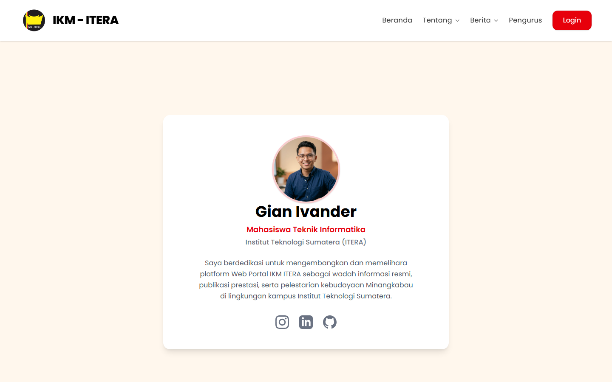

# 🏛️ IKM ITERA Web Portal

[](#-arsitektur--teknologi)
[](https://tailwindcss.com/)
[](https://react.dev/)
[](https://expressjs.com/)

Web Portal Resmi untuk **Ikatan Keluarga Minangkabau - Institut Teknologi Sumatera (IKM ITERA)**. Aplikasi ini dirancang sebagai pusat informasi paguyuban, pelestarian budaya Minangkabau, publikasi berita, serta rekam prestasi akademis dan kebudayaan mahasiswa Minangkabau di lingkungan kampus ITERA.

Proyek ini dibangun dengan pendekatan **Monorepo** yang terbagi atas dua sub-proyek mandiri: **Backend (API Server)** dan **Frontend (SPA React)** yang terhubung secara asinkron menggunakan client Axios.

---

## 📁 Struktur Repositori

Struktur repositori utama diorganisasikan secara rapi untuk memisahkan logika backend dan tampilan frontend:

```text
Web-IKM/
├── backend/                  # Node.js + Express API Server
│   ├── src/
│   │   ├── controllers/      # Logika penanganan logika bisnis dan query database
│   │   ├── data/             # Seeding script dan instansiasi Supabase client
│   │   ├── middleware/       # Autentikasi token JWT
│   │   ├── routes/           # Penentuan rute API Express
│   │   └── server.js         # Entry point server backend (Port default: 5000)
│   ├── .env.example          # Template konfigurasi variabel lingkungan backend
│   └── package.json          # Manajemen dependensi dan skrip backend
│
├── frontend/                 # React SPA (Vite + Tailwind v4)
│   ├── src/
│   │   ├── assets/           # Media gambar, logo, dan ikon lokal
│   │   ├── components/       # Komponen reusable global (Layout, Navbar, Footer, PageTransition)
│   │   ├── data/             # Konstanta data statis (bph_ikm_2026_2027.json, dll)
│   │   ├── pages/            # Halaman SPA (Home, Visi Misi, Makna Logo, Pengurus, Dashboard Admin)
│   │   ├── services/         # Integrasi API client asinkron (Axios)
│   │   ├── index.css         # Styling global Tailwind v4
│   │   ├── main.jsx          # Entry point utama React
│   │   └── App.jsx           # Konfigurasi routing React Router v7
│   └── package.json          # Manajemen dependensi dan skrip frontend
│
└── docs/
    └── screenshots/          # Galeri dokumentasi visual aplikasi
```

---

## 🛠️ Arsitektur & Teknologi

### **Backend (Server & API)**
* **Runtime Environment**: Node.js
* **Web Framework**: Express.js (v5.2)
* **Database & File Storage Cloud**: Supabase (PostgreSQL & Supabase Storage) via `@supabase/supabase-js`
* **Authentication**: JSON Web Token (JWT) via `jsonwebtoken` untuk akses rute terproteksi
* **Hashing Password**: `bcryptjs` untuk keamanan kredensial administrator
* **File Upload Handling**: `multer` (penyimpanan sementara di memori buffer sebelum diunggah ke cloud)
* **Cross-Origin Resource Sharing (CORS)**: `cors` middleware
* **Variabel Lingkungan**: `dotenv`

### **Frontend (User Interface)**
* **Library Utama**: React 19 (dibuat menggunakan modul bundling ultra cepat Vite)
* **Routing**: React Router DOM v7 (mendukung routing deklaratif, redirect dinamis, dan child routes)
* **Styling & Theme**: Tailwind CSS v4 terintegrasi melalui `@tailwindcss/vite` + Custom Marawa Theme
* **Animation & Transitions**: Framer Motion (untuk animasi transisi halaman yang premium dan halus)
* **HTTP Client**: Axios (untuk pengolahan response & request asinkron ke API server)
* **Iconography**: FontAwesome Icons (`@fortawesome/react-fontawesome`)

---

## ⚙️ Konfigurasi Variabel Lingkungan (.env)

Backend memerlukan beberapa variabel lingkungan untuk terhubung dengan Supabase dan memproses otentikasi JWT.
Buat file bernama `.env` di dalam folder `backend/` dengan menyalin contoh dari `backend/.env.example`:

```env
# Port server backend dijalankan
PORT=5000

# URL Database (Prisma/SQLite opsional)
DATABASE_URL="file:./dev.db"

# API Kredensial Supabase (Wajib diisi untuk integrasi Supabase)
SUPABASE_URL="https://your-project-ref.supabase.co"
SUPABASE_KEY="your-supabase-anon-or-service-role-key"

# Secret Key untuk verifikasi Token JWT
JWT_SECRET="masukkan-kunci-rahasia-jwt-anda-di-sini"
```

---

## 🚀 Panduan Menjalankan Aplikasi Secara Lokal

Ikuti langkah-langkah di bawah ini untuk menginstal dependensi dan menjalankan server pengembangan secara lokal.

### **Prasyarat**
Pastikan komputer Anda sudah terinstal:
* [Node.js](https://nodejs.org/) (Sangat direkomendasikan versi LTS terbaru)
* Akun [Supabase](https://supabase.com/) dengan project aktif (jika ingin menggunakan database online)

---

### **Langkah 1: Setup & Menjalankan Backend**

1. Masuk ke direktori `backend`:
   ```bash
   cd backend
   ```
2. Instal semua dependensi Node.js:
   ```bash
   npm install
   ```
3. Duplikat file `.env.example` menjadi `.env` dan sesuaikan nilainya:
   ```bash
   cp .env.example .env
   ```
4. **Seed Database (Opsional)**: Untuk memasukkan data kepengurusan awal dari file JSON ke Supabase, jalankan script seed:
   ```bash
   node src/data/seed_pengurus.js
   ```
5. Jalankan backend dalam mode pengembangan (menggunakan `nodemon` untuk reload otomatis):
   ```bash
   npm run dev
   ```
   * Server backend sekarang berjalan di: **`http://localhost:5000`**

---

### **Langkah 2: Setup & Menjalankan Frontend**

1. Buka terminal baru dan masuk ke direktori `frontend`:
   ```bash
   cd frontend
   ```
2. Instal semua dependensi frontend:
   ```bash
   npm install
   ```
3. Jalankan aplikasi frontend dalam mode pengembangan:
   ```bash
   npm run dev
   ```
   * Aplikasi frontend React sekarang berjalan di: **`http://localhost:5173`** (atau port default Vite lainnya)

---

## 📌 Referensi Rute API (Endpoints)

Semua endpoint API diawali dengan prefiks `/api`.

### **Autentikasi**
| Method | Endpoint | Deskripsi | Autentikasi | Body Parameter |
| :--- | :--- | :--- | :---: | :--- |
| `POST` | `/api/auth/login` | Login admin untuk memperoleh JWT | Publik | `{ "username": "...", "password": "..." }` |

### **Pengurus**
| Method | Endpoint | Deskripsi | Autentikasi | Body Parameter |
| :--- | :--- | :--- | :---: | :--- |
| `GET` | `/api/pengurus` | Mengambil seluruh data struktur pengurus | Publik | - |
| `POST` | `/api/pengurus` | Menambahkan pengurus baru | Admin (JWT) | `{ "role", "name", "description", "periode", "nim_nip", "prodi", "departemen" }` |
| `PUT` | `/api/pengurus/:id` | Memperbarui data pengurus berdasarkan ID | Admin (JWT) | `{ "role", "name", "description", "periode", "nim_nip", "prodi", "departemen" }` |
| `DELETE` | `/api/pengurus/:id` | Menghapus pengurus berdasarkan ID | Admin (JWT) | - |

### **Berita**
| Method | Endpoint | Deskripsi | Autentikasi | Body Parameter |
| :--- | :--- | :--- | :---: | :--- |
| `GET` | `/api/berita` | Mengambil daftar berita terbaru | Publik | - |
| `GET` | `/api/berita/:id` | Mengambil detail berita spesifik berdasarkan ID | Publik | - |
| `POST` | `/api/berita` | Menambahkan berita baru | Admin (JWT) | `{ "title", "date", "content", "image" }` |
| `PUT` | `/api/berita/:id` | Memperbarui berita berdasarkan ID | Admin (JWT) | `{ "title", "date", "content", "image" }` |
| `DELETE` | `/api/berita/:id` | Menghapus berita berdasarkan ID | Admin (JWT) | - |

### **Prestasi**
| Method | Endpoint | Deskripsi | Autentikasi | Body Parameter |
| :--- | :--- | :--- | :---: | :--- |
| `GET` | `/api/prestasi` | Mengambil daftar prestasi mahasiswa | Publik | - |
| `POST` | `/api/prestasi` | Menambahkan prestasi baru | Admin (JWT) | `{ "title", "year", "description" }` |
| `PUT` | `/api/prestasi/:id` | Memperbarui prestasi berdasarkan ID | Admin (JWT) | `{ "title", "year", "description" }` |
| `DELETE` | `/api/prestasi/:id` | Menghapus prestasi berdasarkan ID | Admin (JWT) | - |

### **Media / Upload**
| Method | Endpoint | Deskripsi | Autentikasi | Request Header & Body |
| :--- | :--- | :--- | :---: | :--- |
| `POST` | `/api/upload` | Mengunggah gambar ke cloud bucket Supabase | Admin (JWT) | Header: `Content-Type: multipart/form-data`<br>Body: `image` (file binary, max 5MB) |

---

## 🎨 Desain Identitas & Palet Warna Budaya (Marawa)

Aplikasi ini mengusung visualisasi bertema Minangkabau yang berkelas dengan menerapkan gradien warna bendera adat Minangkabau (**Marawa**):

* 🔴 **Merah Minang (`#8B0000` ke `#D22B2B`)**: Melambangkan keberanian, kehangatan kekeluargaan, dan dinamisme pemuda Minang.
* 🟡 **Kuning Minang (`#FFD700`)**: Melambangkan keagungan, kejayaan, intelektualitas, dan budi peti.
* ⚫ **Hitam Minang (`#111111` ke `#1A1A1A`)**: Melambangkan ketegasan, kekuatan hukum adat, dan pondasi kepemimpinan.
* ✨ **Marawa Gradient**: Sentuhan gradien transisi modern yang memadukan ketiga warna tersebut untuk memberikan kesan premium dan artistik di berbagai komponen web portal.

---

## 📷 Dokumentasi Visual & Antarmuka (Screenshots)

Berikut adalah rekam visual antarmuka platform IKM ITERA Web Portal:

| Halaman | Deskripsi Visual | File Path |
| :--- | :--- | :--- |
| **1. Beranda (Home)** | Menampilkan landing page premium dengan Marawa Gradient, animasi pembuka, dan informasi umum organisasi. |  |
| **2. Tentang (Latar Belakang)** | Informasi mengenai sejarah berdirinya IKM ITERA di kampus Institut Teknologi Sumatera. |  |
| **3. Galeri Berita (News)** | Halaman portal berita untuk menampilkan artikel, pengumuman, dan berita terbaru IKM ITERA. |  |
| **4. Detail Berita** | Tampilan detail konten satu artikel secara utuh lengkap dengan banner gambar resolusi penuh. |  |
| **5. Prestasi (Achievements)** | Galeri kartu prestasi akademik dan non-akademik mahasiswa Minangkabau ITERA. |  |
| **6. Organogram (Pengurus)** | Bagan kepengurusan interaktif (Dosen Pembina, BPH, dan 6 departemen) dilengkapi filter per tahun kepengurusan. |  |
| **7. Login Admin** | Form autentikasi administrator menggunakan sistem validasi token JWT. |  |
| **8. Dashboard Admin - Pengurus** | Dashboard tab panel default untuk melakukan CRUD data kepengurusan organisasi. |  |
| **9. Dashboard Admin - Berita** | Dashboard panel khusus pengelolaan artikel berita, integrasi dengan cloud image upload. |  |
| **10. Dashboard Admin - Prestasi** | Dashboard panel untuk mencatat prestasi baru atau melakukan edit/delete pencapaian. |  |
| **11. Modal Form CRUD** | Tampilan form input popup adaptif (dinamis menyesuaikan tab yang aktif) saat menambah/mengedit data. |  |
| **12. Halaman Developer** | Profil halaman pengembang website dengan foto, bio, dan tautan media sosial interaktif (Instagram, LinkedIn, GitHub). |  |

---

## 👥 Kontribusi

Silakan ajukan Issue atau Pull Request jika ingin menambahkan fitur baru atau memperbaiki bug. Untuk perubahan besar, mohon buka Issue terlebih dahulu untuk mendiskusikan apa yang ingin Anda ubah.

---

## 📄 Lisensi

Proyek ini dilisensikan di bawah **ISC License**.
