# 🏛️ IKM ITERA Web Portal

Web Portal Resmi untuk **Ikatan Keluarga Minangkabau - Institut Teknologi Sumatera (IKM ITERA)**. Aplikasi ini dirancang sebagai pusat informasi paguyuban, pelestarian budaya Minangkabau, serta publikasi berita dan prestasi mahasiswa Minang di lingkungan kampus ITERA.

Proyek ini dibangun menggunakan arsitektur **Monorepo** dengan pemisahan penuh antara backend dan frontend (Decoupled System).

---

## 📁 Struktur Repositori

```text
Web-IKM/
├── backend/               # Node.js + Express API
│   ├── src/
│   │   ├── controllers/   # Logika penanganan request API
│   │   ├── data/          # Database tiruan (Mock Database)
│   │   ├── routes/        # Definisi rute Express
│   │   └── server.js      # Titik masuk utama backend (Port: 5000)
│   └── package.json
│
├── frontend/              # React + Vite (Tailwind CSS v4)
│   ├── src/
│   │   ├── components/    # Komponen global (Layout, Header, Footer)
│   │   ├── data/          # Konstanta & data lokal frontend
│   │   ├── pages/         # Halaman SPA (Home, Tentang, Portal, Pengurus)
│   │   ├── services/      # Layanan API (Axios/Fetch)
│   │   └── main.jsx
│   └── package.json
```

---

## 🛠️ Arsitektur & Teknologi

### **Backend**
* **Runtime**: Node.js
* **Framework**: Express.js
* **Module System**: ES6 Modules (`"type": "module"`)
* **Dependencies**: `cors`, `dotenv`

### **Frontend**
* **Framework**: React 19 (Vite)
* **Styling**: Tailwind CSS v4 + Custom Minangkabau Theme Styles (seperti `.bg-minang` & `.marawa-gradient`)
* **Routing**: React Router DOM v7
* **API Client**: Fetch API (atau Axios untuk pemanggilan asinkron)

---

## 🚀 Cara Menjalankan Aplikasi Secara Lokal

Pastikan Anda telah menginstal [Node.js](https://nodejs.org/) di komputer Anda.

### **1. Jalankan Backend (API)**
Buka terminal baru di direktori root proyek:
```bash
cd backend
npm install
npm run dev
```
Backend akan berjalan di: **`http://localhost:5000`**

### **2. Jalankan Frontend (React)**
Buka terminal baru lagi dari direktori root proyek:
```bash
cd frontend
npm install
npm run dev
```
Frontend akan berjalan di: **`http://localhost:5173`** (atau port default Vite lainnya)

---

## 📌 Rute API Utama (Backend)
Semua endpoint API diawali dengan `/api`:
* **`GET /api/pengurus`** - Mengembalikan struktur kepengurusan lengkap (Dosen Pembina, BPH, Departemen).
* **`GET /api/berita`** - Mengembalikan daftar berita terkini mengenai kegiatan IKM ITERA.
* **`GET /api/prestasi`** - Mengembalikan daftar prestasi kebudayaan/akademis anggota.

---

## 🎨 Palet Warna & Desain Budaya
Aplikasi menggunakan identitas budaya Minangkabau lewat kombinasi warna **Marawa** (Hitam, Merah, Kuning):
* **Merah Minang (`#8B0000` - `#D22B2B`)**: Melambangkan keberanian dan kehangatan kekeluargaan.
* **Marawa Gradient**: Digunakan pada elemen sorotan untuk memperkuat identitas organisasi.

---

## 📷 Galeri Tampilan Website (Screenshots)

Berikut adalah dokumentasi visual tampilan antarmuka dari IKM ITERA Web Portal:

### 1. Halaman Utama (Home)
Halaman depan yang menyambut pengunjung dengan visualisasi bertema Minangkabau (Marawa gradient) dan informasi umum sekilas mengenai IKM ITERA.
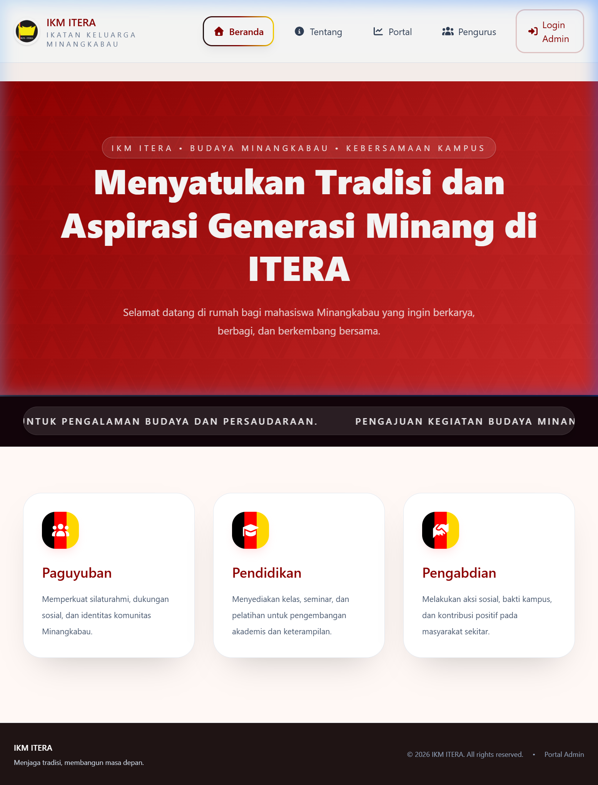

### 2. Halaman Tentang (About)
Menjelaskan sejarah, visi, misi, dan nilai-nilai budaya Minangkabau yang dijunjung tinggi oleh IKM ITERA.
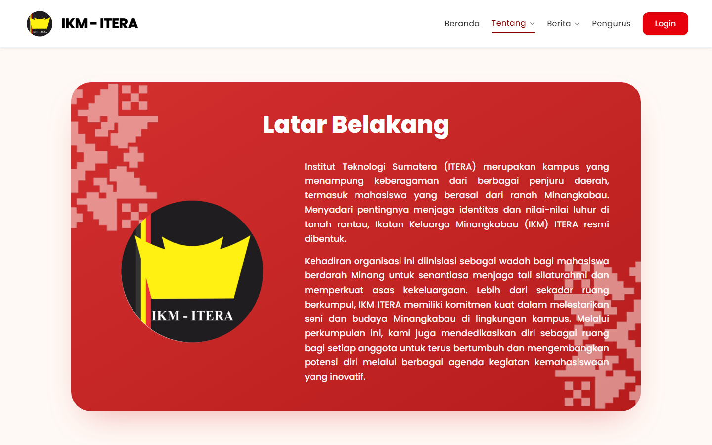

### 3. Halaman Berita Terkini (News)
Pusat informasi berita terbaru mengenai seluruh kegiatan, acara, dan laporan aktivitas rutin dari IKM ITERA.
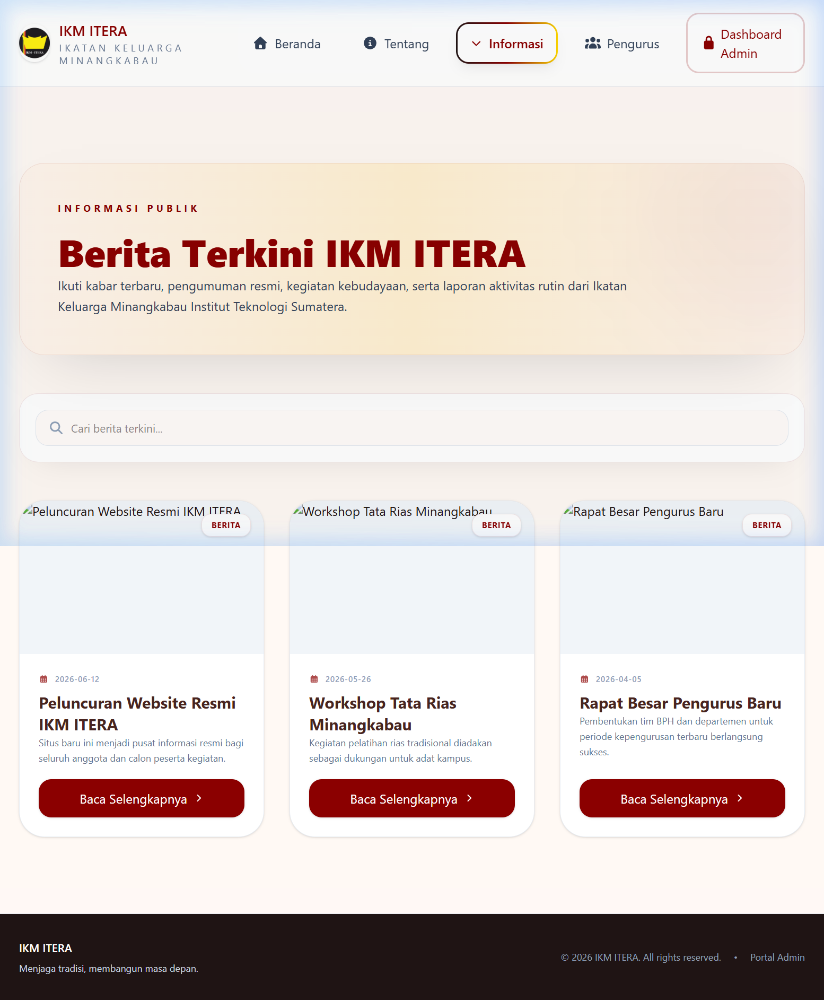

### 4. Halaman Detail Berita
Tampilan detail artikel/berita lengkap yang menyertakan teks berita utuh beserta gambar pendukung.
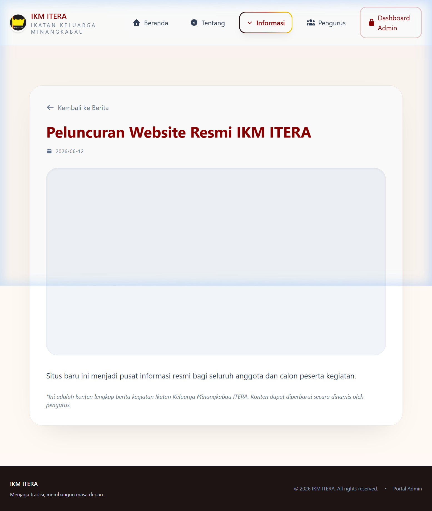

### 5. Halaman Prestasi Mahasiswa (Achievements)
Halaman apresiasi dan dokumentasi prestasi yang diraih oleh mahasiswa Minangkabau ITERA baik dalam bidang akademik maupun non-akademik.
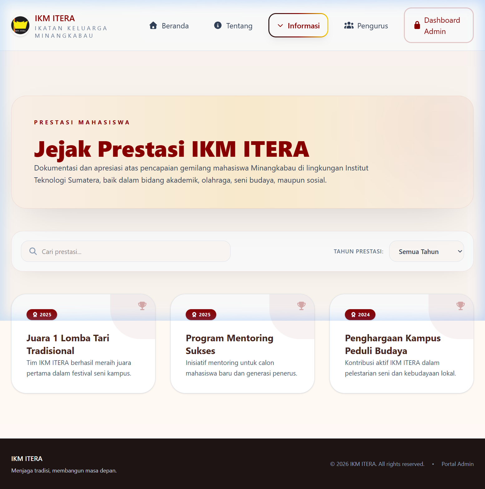

### 6. Halaman Struktur Kepengurusan (Committee - Organogram)
Menampilkan bagan hirarki/organogram kepengurusan visual yang premium. Struktur ini memetakan Dosen Pembina, pimpinan utama (Datuak, Bundo Kanduang, Cadiak Pandai, Suluah Bendang), kesekretariatan & kebendaharaan bercabang, hingga 6 departemen kerja lengkap dengan filter periode kepengurusan.
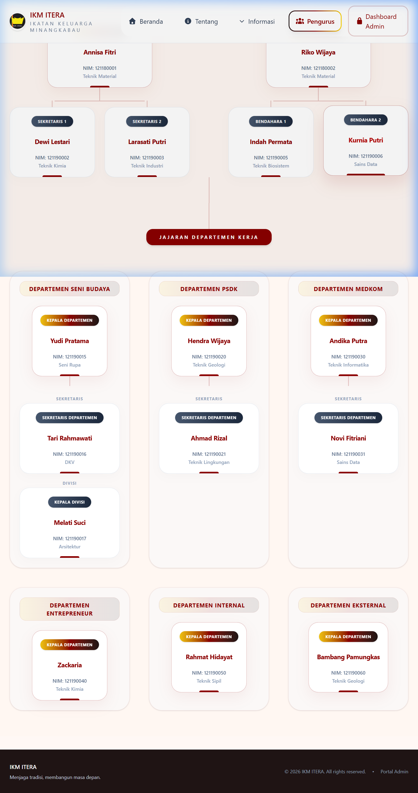

### 7. Halaman Login Administrator
Halaman autentikasi khusus bagi pengurus untuk masuk ke dashboard admin guna mengelola konten website.
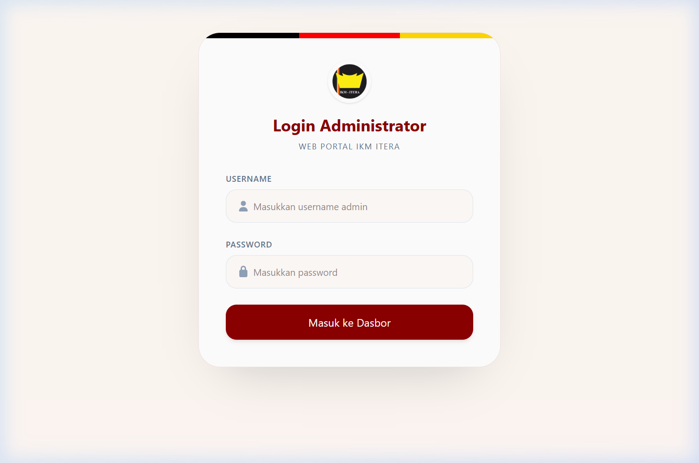

### 8. Halaman Dashboard Admin - Manajemen Pengurus (Tab Default)
Panel kendali utama admin yang menampilkan daftar Badan Pengurus Harian (BPH) dan departemen lengkap dengan kolom **NIM/NIP**, **Prodi**, **Departemen**, dan **Periode**. Dari panel ini, administrator dapat mencari, menambah, memperbarui, atau menghapus data pengurus secara interaktif.
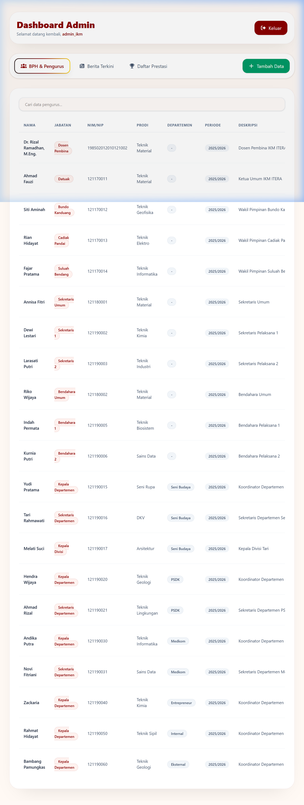

### 9. Halaman Dashboard Admin - Manajemen Berita (Tab Berita)
Panel khusus untuk mengelola konten berita dan artikel kegiatan IKM ITERA. Dilengkapi dengan daftar ringkasan berita, fitur pencarian berita, serta opsi edit/hapus.
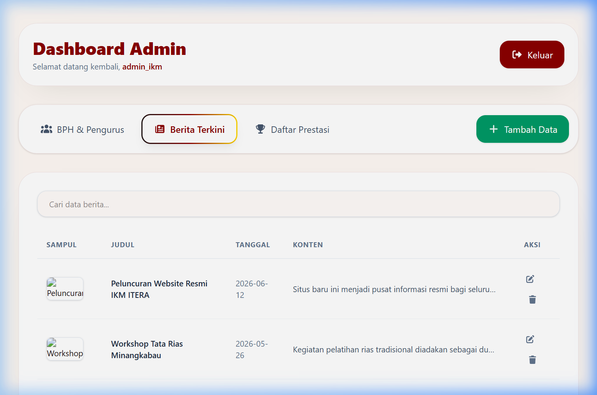

### 10. Halaman Dashboard Admin - Manajemen Prestasi (Tab Prestasi)
Panel khusus untuk mengelola rekam jejak prestasi mahasiswa/organisasi Minangkabau di lingkungan ITERA.
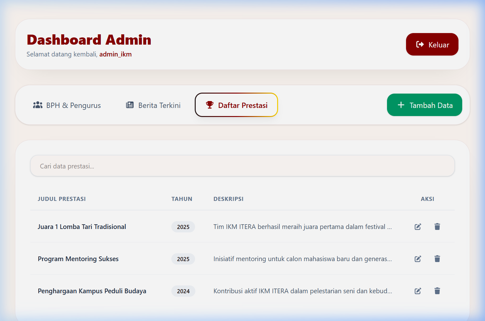

### 11. Halaman Dashboard Admin - Formulir Tambah/Edit Data (Modal)
Tampilan pop-up modal formulir interaktif ketika tombol **Tambah Data** diklik. Form ini menyesuaikan input field-nya secara cerdas berdasarkan tab manajemen data yang sedang aktif (Pengurus, Berita, atau Prestasi) dan kini dilengkapi dengan input **Periode Kepengurusan** untuk data pengurus.
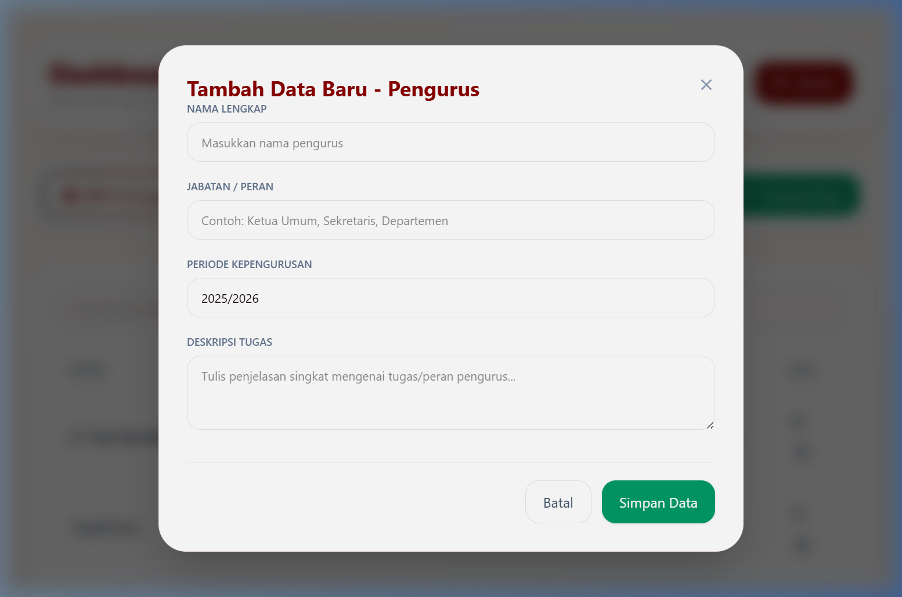

